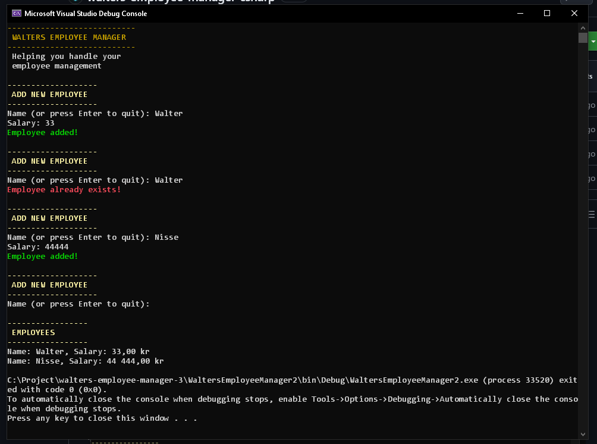

# 🌛 $${\color{yellow}WALTERS  \space  \space  EMPLOYEE \space \space MANAGER}$$ 
**$${\color{yellow}TECH}$$** C#, .NET, Console App 
$${\color{yellow}START:}$$ 2026-10-05 13.00  \space  \space  \space  $${\color{yellow}DEADLINE:}$$ 2026-10-06 10.00  

Small school project at the $${\color{red}LEXICON}$$ education $${\color{red}.NET Fullstack developer}$$ $${\color{yellow}2026}$$ showcasing how to make a small "console app" that handles employee management.

 

 

**$${\color{yellow}INSTRUCTIONS}$$** 
C# Övning 1 - Personalregister  
✅ 1. Add to source control nere i högra hörnet, välj git, Alternativt Git menyn Create Git 
Repository  
✅ 2. Kryssa UR Checkboxen Private  
✅ 3. Create and Publish  
✅ 4. Kontrollera att repositoriet skapats i webbläsaren och alla filer finns med. Om så är 
fallet kan du hoppa över resten. Annars följ nästa steg.  
✅ 5. Gå till git changes i Visual Studio.  
✅ 6. Skriv in ett commit meddelande tryck på Commit  
✅ 7. Efter det Push med pilen uppåt. Alternativt Sync med två pilar i en cirkel.  
✅ 8. Kontrollera enligt punkt 4.  
✅ 9. Klart  
 
 

**$${\color{yellow}BAKGRUND}$$** 
Ett litet företag i restaurangbranschen kontaktar dig för att utveckla ett litet personalregister.  
 

De har endast två krav 
✅1. Registret skall kunna ta emot och lagra anställda med namn och lön. (via inmatning  i konsolen, inget krav på persistent lagring)  
✅2. Programmet skall kunna skriva ut registret i en konsol.  
 
 

|   |
| --- |
| **$${\color{yellow}ASSIGNMENT 1}$$** |
| ✅ Vilka klasser bör ingå i programmet? |
| $${\color{yellow}My answer: Employee, EmployeeManager}$$ |
 

|   |
| --- |
| **$${\color{yellow}ASSIGNMENT 2}$$** |
| ✅ Vilka attribut och metoder bör ingå i dessa klasser? |
| $${\color{yellow}My answer:}$$ |
| $${\color{green}void \space EmployeeManager.Employee.Create(Employee \space employee)}$$ |
| $${\color{green}List<Employee> \space EmployeeManager.Employee.GetAll()}$$ |
| $${\color{green}string \space Employee.Name}$$ |
| $${\color{green}int \space Employee.Salary}$$ |
 

|   |
| --- |
| **$${\color{yellow}ASSIGNMENT 3}$$** |
| ✅ Skriv programmet |
| ✅ Försök göra programmet så robust och framtidssäkert som möjligt! |
| ✅ Ni får gärna lägga på extra funktionalitet! |
| $${\color{green}Checking \space if \space employee \space already \space exists. \space instead \space \space of \space creating \space show \space error \space message \space in \space red \space text}$$ |
| $${\color{green}Trim() \space to \space prevent \space \"Walter \space \space \" \space to \space be \space added \space if \space \"Walter\" \space already \space exists}$$ |
| ❌ Bonus för att implementera test! (men inte på bekostnad av att den andra koden blir 
lidande) |
 

| $${\color{red}DEADLINE}$$ |
| --- |
| $${\color{red}Koden \space ska \space ligga \space \space uppe \space på \space GIT \space senast \space imorgon, \space 6 \space oktober \space 2026, \space kl. \space 10.00}$$ |

# 🌈 $${\color{green}Lycka \space till!}$$ 🍀
